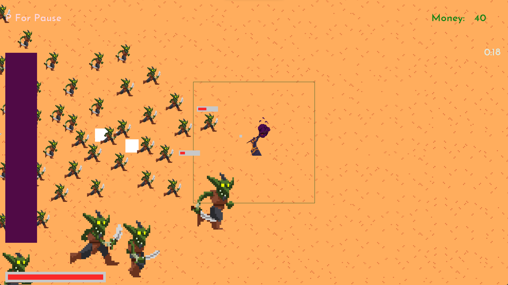
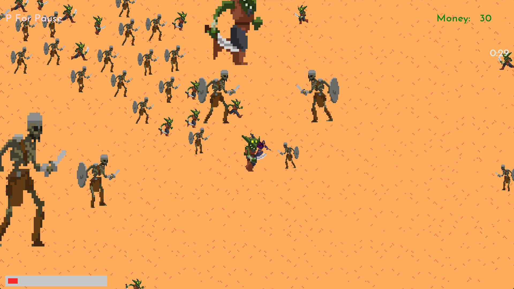
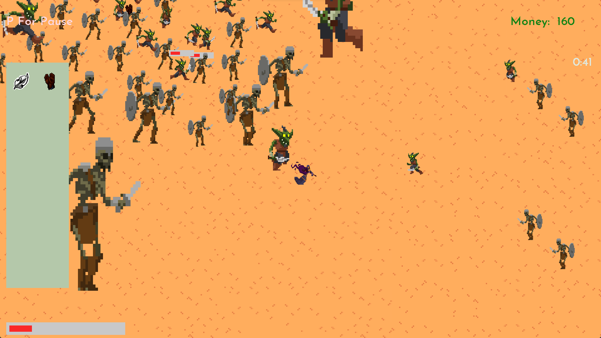

# Rougelike-C-Game
it was a huge mistake to start this lol. I didn't know that I should have use new technologies. Now I know.

I made all the functions and everything in this game. 
I used C language and SDL2 libraries. For ide i used Microsoft Visual Studio.

I am planning to put it on steam!

first versions

last versions

